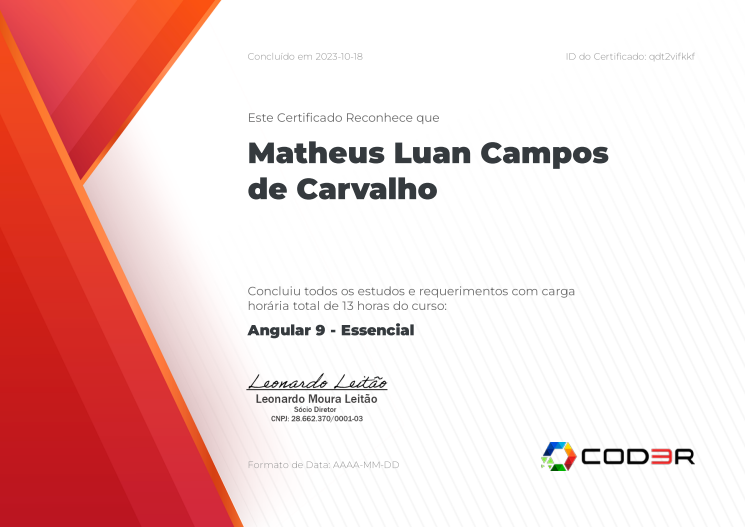

<h1>Projeto de cadastro de produtos</h1>
<h2>Construção de uma API simples feita em Angular</h2>

<i>Autor: Matheus Carvalho</i>

    
     

    Criação de um CRUD simples com o enfoque na tecnologia Angular.
    Essa API foi feita como intuito de aprendizagem e formação 
    profissional FullStack pela empresa Decisão Sistemas. 
    O curso foi feito pela empresa Cod3r e se encontra em: 
    <a href="https://www.cod3r.com.br/" target="_blank">https://www.cod3r.com.br/</a>

 

    
Abaixo segue meu certificado de conclusão do curso.

    

